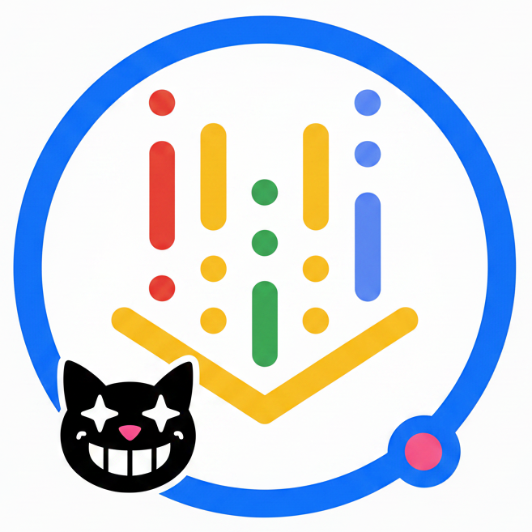

    
    <b>Google Vertex AI Provider</b>

Add Google Vertex AI as an LLM and Embedding provider for Cheshire Cat AI, using service account authentication.

## Description

**Google Vertex AI Provider** is a plugin for Cheshire Cat AI that integrates Google Vertex AI as both an LLM and an Embedder provider. It uses GCP service account credentials for authentication, making it suitable for production deployments on Google Cloud.

The plugin registers two providers:
1. **LLM Provider**: Uses `ChatVertexAI` from LangChain for chat-based language model interactions
2. **Embedder Provider**: Uses `VertexAIEmbeddings` from LangChain for text embedding generation

## Features

- **Service Account Authentication**: Authenticates via a JSON service account key, no manual ADC setup needed
- **LLM Provider**: Supports Gemini models (default: `gemini-2.5-flash`) with configurable temperature, max tokens, and streaming
- **Embedder Provider**: Supports Vertex AI embedding models (default: `gemini-embedding-001`)
- **Configurable Region**: Choose the GCP region from a dropdown with all available Vertex AI locations (default: `europe-west1`)

## Settings

### LLM Settings

- **`project_id`**: *(String)* - Your Google Cloud project ID
- **`location`**: *(Dropdown, default: "europe-west1")* - GCP region for the Vertex AI endpoint, selectable from all available Vertex AI locations
- **`service_account_json`**: *(Text Area)* - The full JSON content of your GCP service account key
- **`model_name`**: *(String, default: "gemini-2.5-flash")* - The Vertex AI model to use
- **`temperature`**: *(Float, default: 0.7)* - Sampling temperature for response generation
- **`max_output_tokens`**: *(Integer, default: 8192)* - Maximum number of tokens in the response
- **`streaming`**: *(Boolean, default: True)* - Enable streaming responses

### Embedder Settings

- **`project_id`**: *(String)* - Your Google Cloud project ID
- **`location`**: *(Dropdown, default: "europe-west1")* - GCP region for the Vertex AI endpoint, selectable from all available Vertex AI locations
- **`service_account_json`**: *(Text Area)* - The full JSON content of your GCP service account key
- **`model_name`**: *(String, default: "gemini-embedding-001")* - The embedding model to use

## Requirements

- Cheshire Cat AI
- A Google Cloud project with the Vertex AI API enabled
- A GCP service account key (JSON) with Vertex AI permissions

## Installation

1. Install the plugin through the Cheshire Cat Admin UI or clone it into the `plugins` folder
2. Select **Google Vertex AI** as your LLM and/or Embedder in the Cat settings
3. Paste your service account JSON and configure your project ID and region

---

Author: OpenCity Labs

LinkedIn: https://www.linkedin.com/company/opencity-italia/

